# 📊 Diagramas da Arquitetura 

Visualizações da arquitetura do ecossistema SIL usando Mermaid.

---

## 🌀 1. Visão Geral do Sistema

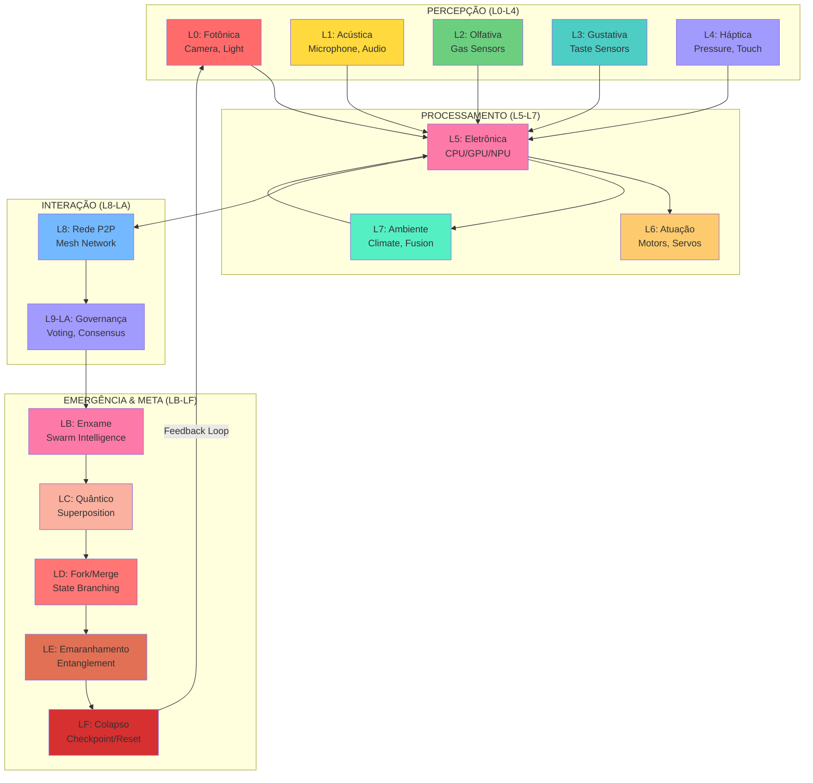

---

## 🎭 2. Arquitetura do Orchestrator

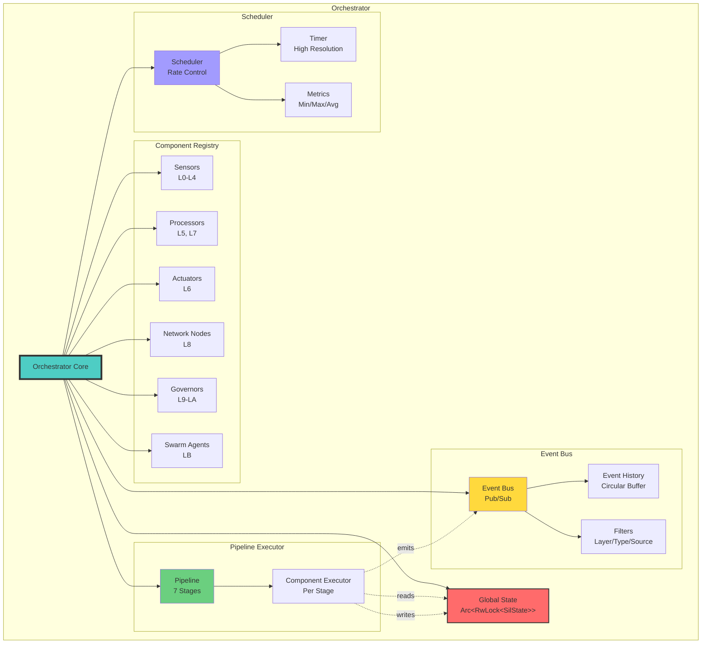

---

## 🔄 3. Pipeline de Execução

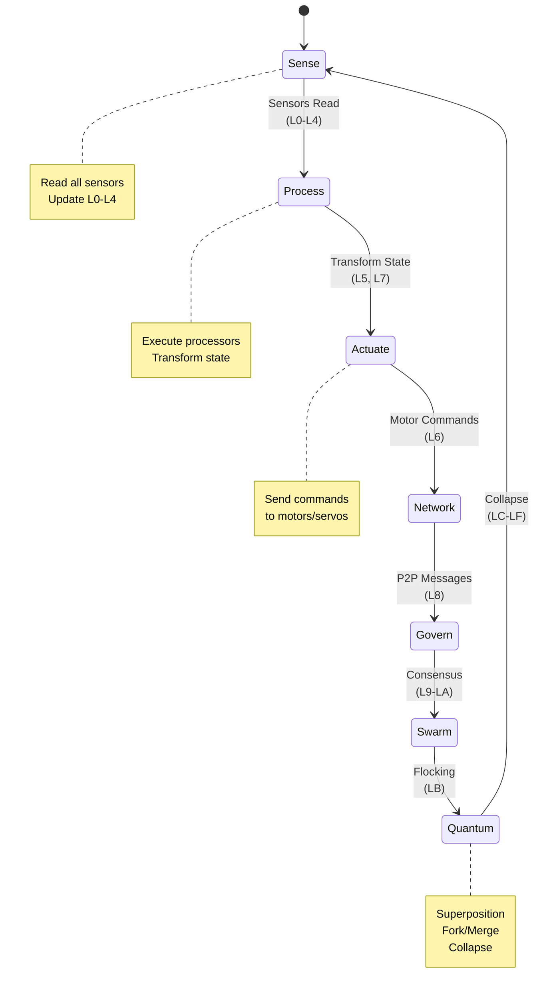

---

## 📡 4. Padrões de Comunicação

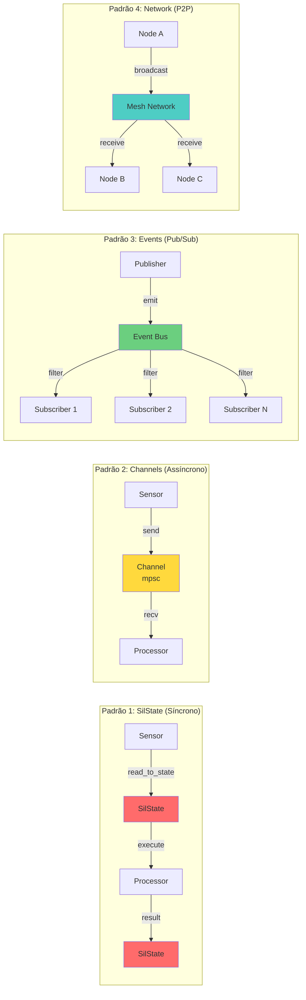

---

## 🧮 5. ByteSil: Representação Log-Polar

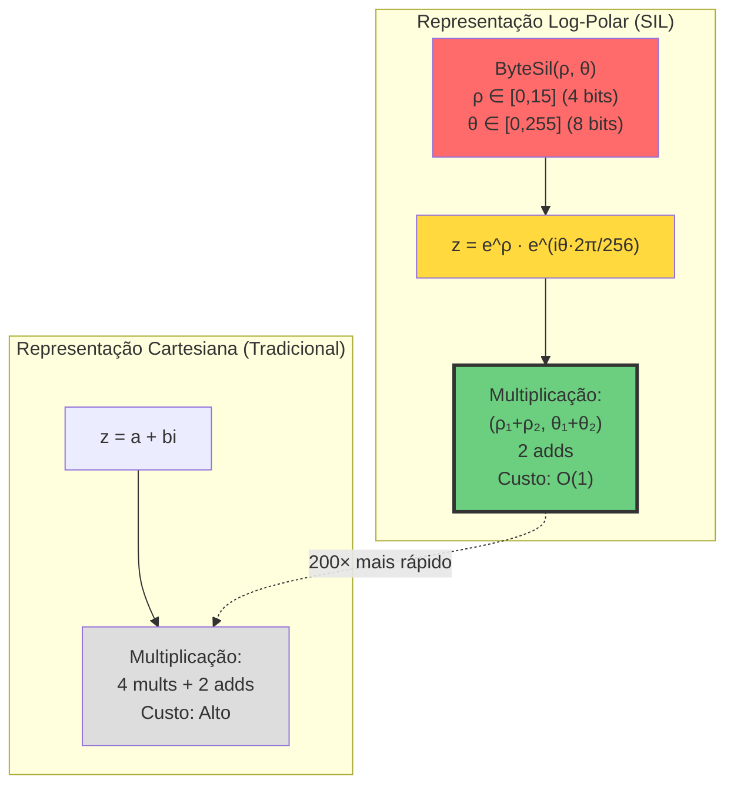

---

## 🔀 6. Computação Quântica (Fork/Merge)

```mermaid
graph TB
    START[Estado Inicial<br/>SilState]

    subgraph "Superposição"
        SP1[Estado 1<br/>peso: 0.5]
        SP2[Estado 2<br/>peso: 0.3]
        SP3[Estado 3<br/>peso: 0.2]
        SUPER[Estado Superposto<br/>Σ(wᵢ·sᵢ)]
    end

    subgraph "Fork/Merge"
        SUPER2[Estado Superposto]
        FORK1[Fork 1<br/>Estratégia A]
        FORK2[Fork 2<br/>Estratégia B]
        MERGE[Merge<br/>Max/Min/Avg/XOR]
        RESULT[Estado Mesclado]
    end

    subgraph "Colapso"
        RESULT2[Estado Final]
        COLLAPSE[Collapse<br/>seed: 42]
        COLLAPSED[Estado Colapsado<br/>Escolhe 1 estado]
    end

    START --> SP1
    START --> SP2
    START --> SP3

    SP1 --> SUPER
    SP2 --> SUPER
    SP3 --> SUPER

    SUPER --> SUPER2

    SUPER2 --> FORK1
    SUPER2 --> FORK2

    FORK1 --> MERGE
    FORK2 --> MERGE

    MERGE --> RESULT

    RESULT --> RESULT2
    RESULT2 --> COLLAPSE
    COLLAPSE --> COLLAPSED

    style START fill:#a29bfe
    style SUPER fill:#fab1a0
    style SUPER2 fill:#fab1a0
    style MERGE fill:#ff7675
    style COLLAPSED fill:#d63031,stroke:#333,stroke-width:3px
```

---

## 🐝 7. Swarm Intelligence (Flocking)

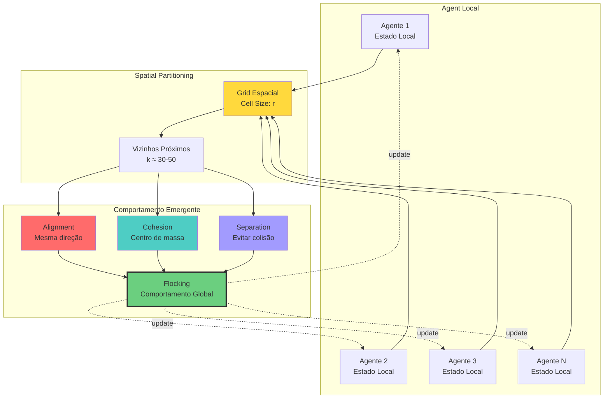

---

## 🌐 8. Rede P2P Mesh

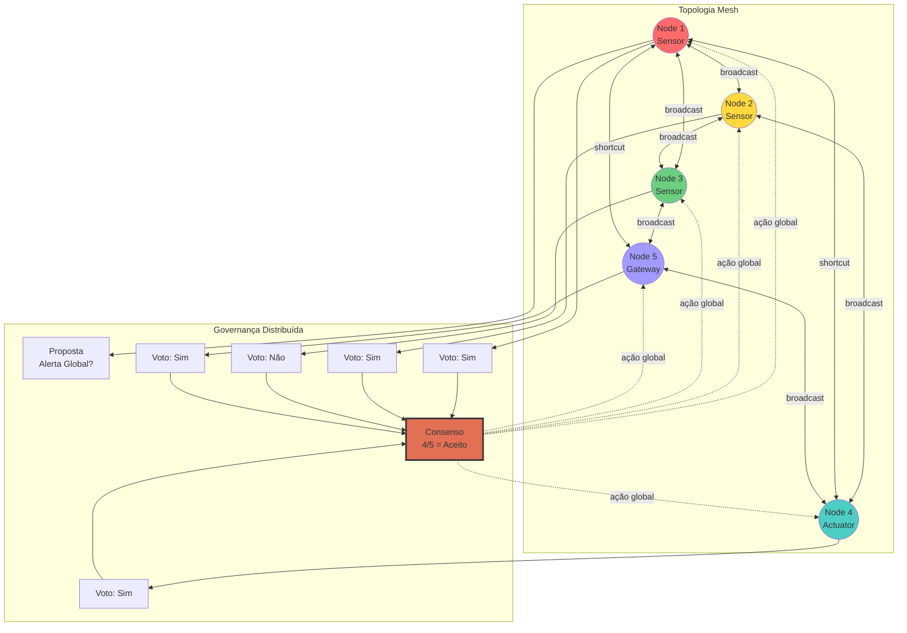

---

## 🔧 9. VSP (Virtual Sil Processor)

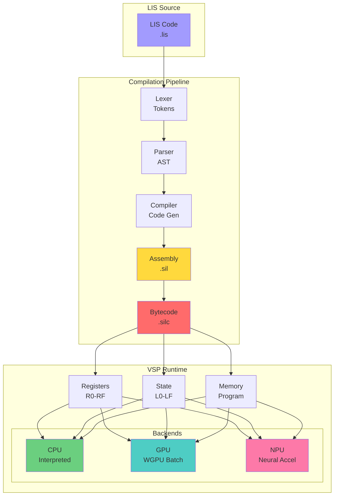

---

## 📊 10. Performance (Latency Budget)

```mermaid
gantt
    title Pipeline Latency Budget (100 Hz = 10ms)
    dateFormat X
    axisFormat %L

    section Stages
    Sense (L0-L4)     :done, s1, 0, 50
    Process (L5,L7)   :done, s2, 50, 150
    Actuate (L6)      :done, s3, 150, 170
    Network (L8)      :done, s4, 170, 180
    Govern (L9-LA)    :done, s5, 180, 185
    Swarm (LB)        :done, s6, 185, 187
    Quantum (LC-LF)   :done, s7, 187, 190
    Orchestrator      :done, s8, 190, 190

    section Budget
    Slack (98.1%)     :crit, slack, 190, 10000
```

---

## 🚀 11. Roadmap de Desenvolvimento

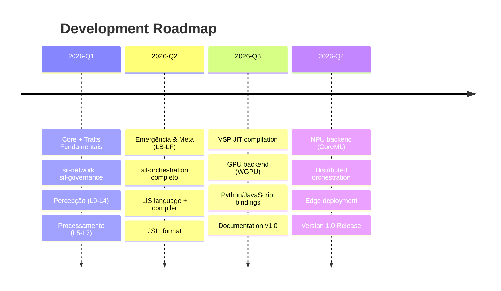

---

## 📈 12. Scaling Behavior

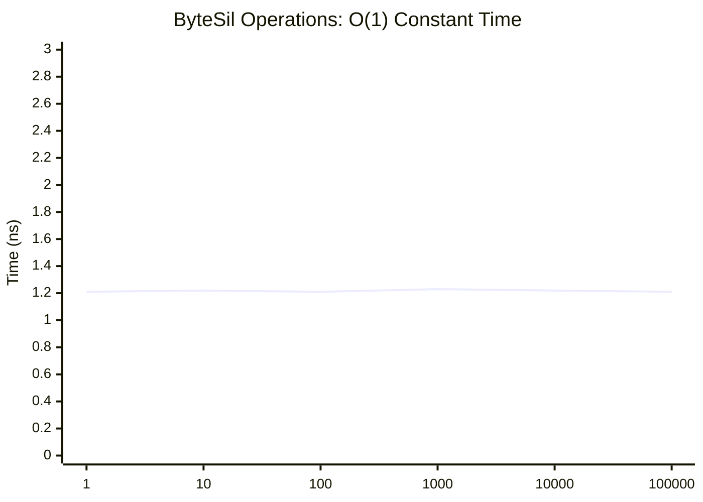

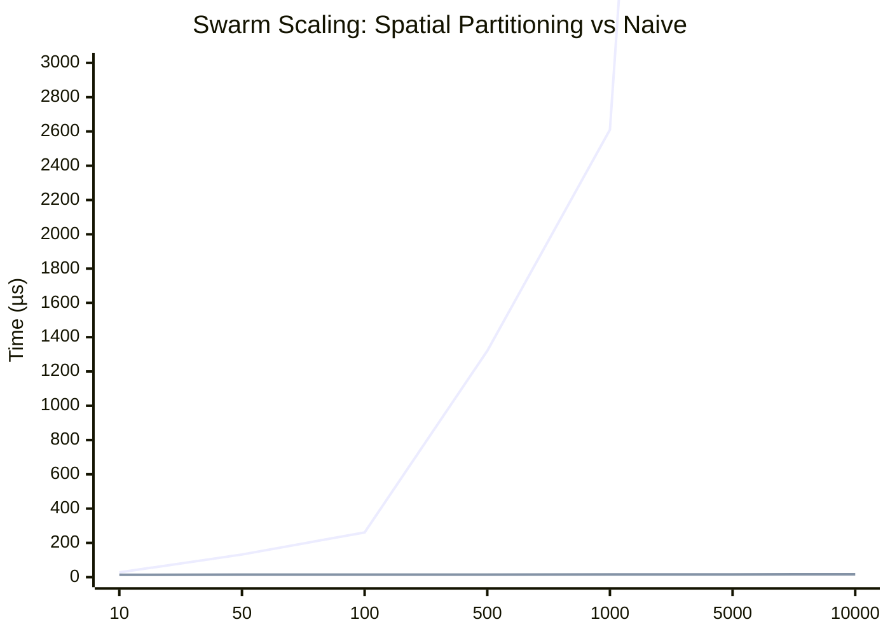

---

## 🎯 Como Usar Estes Diagramas

### Renderizar no GitHub

Os diagramas Mermaid são renderizados automaticamente no GitHub:
- Abra este arquivo no GitHub
- Os diagramas aparecem como gráficos interativos

### Renderizar Localmente

1. **VSCode**: Instale extensão "Markdown Preview Mermaid Support"
2. **CLI**: Use `mmdc` (mermaid-cli)
   ```bash
   npm install -g @mermaid-js/mermaid-cli
   mmdc -i DIAGRAMS.md -o diagrams.pdf
   ```

### Exportar para Imagens

```bash
# SVG
mmdc -i DIAGRAMS.md -o diagrams/ -t svg

# PNG
mmdc -i DIAGRAMS.md -o diagrams/ -t png
```

---

## 📚 Recursos

- [Mermaid Documentation](https://mermaid.js.org/)
- [ARCHITECTURE.md](ARCHITECTURE.md) — Arquitetura completa (texto)
- [EXAMPLES.md](EXAMPLES.md) — Casos de uso práticos
- [PERFORMANCE.md](PERFORMANCE.md) — Benchmarks detalhados

---

**⧑** *Uma imagem vale mil palavras. Um diagrama vale mil commits.*
