# SIL - Diagramas de Arquitetura

> Visualização completa da arquitetura do projeto SIL/LIS usando diagramas Mermaid

---

## 1. Arquitetura Geral do Sistema

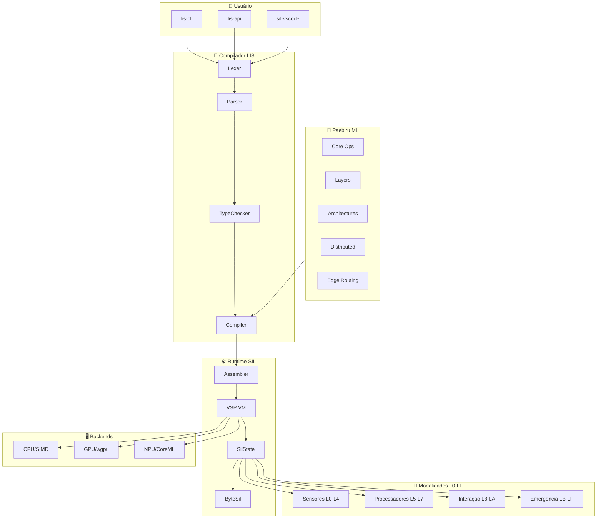

---

## 2. Pipeline de Compilação

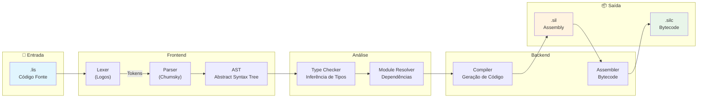

---

## 3. Modelo de 16 Camadas (L0-LF)

```mermaid
flowchart TB
    subgraph PERCEPTION["🎯 PERCEPÇÃO (L0-L4)"]
        direction LR
        L0["L0<br/>Photonic<br/>👁️ Visual"]
        L1["L1<br/>Acoustic<br/>👂 Audio"]
        L2["L2<br/>Olfactory<br/>👃 Olfato"]
        L3["L3<br/>Gustatory<br/>👅 Gustativo"]
        L4["L4<br/>Dermic<br/>✋ Tátil"]
    end

    subgraph PROCESSING["⚡ PROCESSAMENTO (L5-L7)"]
        direction LR
        L5["L5<br/>Electronic<br/>🔌 Sinais"]
        L6["L6<br/>Psychomotor<br/>🦾 Atuação"]
        L7["L7<br/>Environmental<br/>🌍 Contexto"]
    end

    subgraph INTERACTION["🌐 INTERAÇÃO (L8-LA)"]
        direction LR
        L8["L8<br/>Cybernetic<br/>🔗 Rede"]
        L9["L9<br/>Geopolitical<br/>🏛️ Governança"]
        LA["LA<br/>Cosmopolitical<br/>⚖️ Ética"]
    end

    subgraph EMERGENCE["✨ EMERGÊNCIA (LB-LC)"]
        direction LR
        LB["LB<br/>Synergic<br/>🐝 Enxame"]
        LC["LC<br/>Quantum<br/>⚛️ Quântico"]
    end

    subgraph META["🔮 META (LD-LF)"]
        direction LR
        LD["LD<br/>Superposition<br/>📊 Multi-estado"]
        LE["LE<br/>Entanglement<br/>🔀 Correlação"]
        LF["LF<br/>Collapse<br/>🎯 Resolução"]
    end

    PERCEPTION --> PROCESSING
    PROCESSING --> INTERACTION
    INTERACTION --> EMERGENCE
    EMERGENCE --> META
    META -->|"Feedback Loop"| PERCEPTION

    style PERCEPTION fill:#e3f2fd
    style PROCESSING fill:#fff3e0
    style INTERACTION fill:#e8f5e9
    style EMERGENCE fill:#f3e5f5
    style META fill:#fce4ec
```

---

## 4. ByteSil - Representação Log-Polar

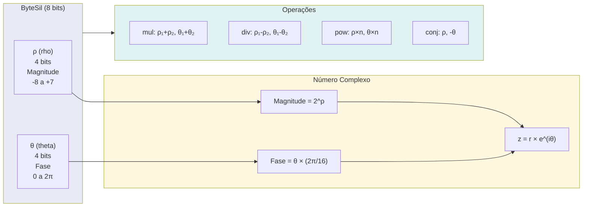

---

## 5. SilState - Container de 16 Camadas

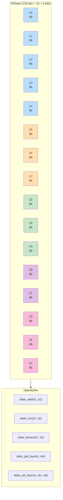

---

## 6. Estrutura de Crates do Workspace

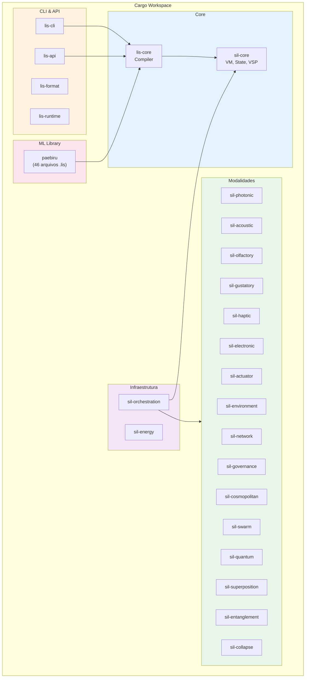

---

## 7. Ciclo Fechado de Execução

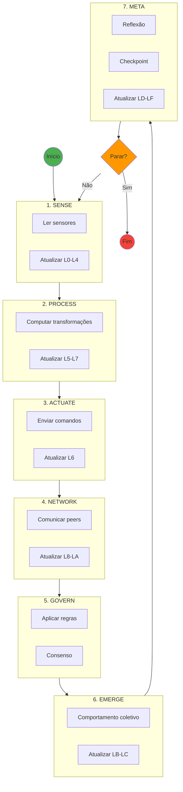

---

## 8. Virtual Sil Processor (VSP)

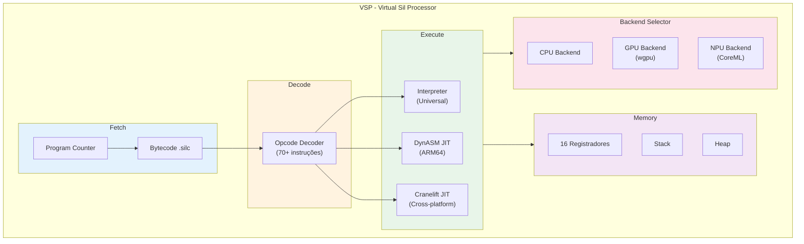

---

## 9. Arquitetura Paebiru ML

```mermaid
flowchart TB
    subgraph PAEBIRU["Paebiru ML Library"]
        subgraph CORE_ML["core/"]
            BYTESIL_OPS["bytesil.lis<br/>Operações ByteSil"]
            STATE_OPS["state.lis<br/>Operações State"]
            ACTIVATIONS["activations.lis<br/>ReLU, Sigmoid, GELU, Softmax"]
            LOSS["loss.lis<br/>MSE, CrossEntropy, Cosine"]
            OPTIM["optim.lis<br/>SGD, Gradient Clipping"]
            LINALG["linalg.lis<br/>Dot, Norms"]
        end

        subgraph LAYERS_ML["layers/"]
            DENSE["dense.lis<br/>Fully Connected"]
            NORM["norm.lis<br/>LayerNorm, RMSNorm"]
            DROPOUT["dropout.lis<br/>Regularização"]
            RESIDUAL["residual.lis<br/>Skip Connections"]
        end

        subgraph ARCH_ML["arch/"]
            ATTENTION["attention.lis<br/>Scaled Dot-Product"]
            FFN["ffn.lis<br/>Feed Forward"]
            TRANSFORMER["transformer.lis<br/>Encoder/Decoder"]
            KAN["kan.lis<br/>Kolmogorov-Arnold"]
            SSM["ssm.lis<br/>Mamba/S4"]
            LNN["lnn.lis<br/>Liquid Neural Nets"]
            RNN["recurrent.lis<br/>RNN/LSTM/GRU"]
            SNN["snn.lis<br/>Spiking Neural Nets"]
        end

        subgraph DIST_ML["distributed/"]
            FEDAVG["fedavg.lis<br/>FedAvg Aggregation"]
            BYZANTINE["byzantine.lis<br/>Byzantine Robust"]
            COMPRESS["compress.lis<br/>Top-K, Quantization"]
            PRIVACY["privacy.lis<br/>Differential Privacy"]
        end

        subgraph EDGE_ML["edge/"]
            DEVICE["device.lis<br/>Device Detection"]
            RHO_SIL["rho_sil.lis<br/>Complexity Metric"]
            ROUTER["router.lis<br/>Auto-routing"]
        end
    end

    CORE_ML --> LAYERS_ML
    LAYERS_ML --> ARCH_ML
    ARCH_ML --> DIST_ML
    DIST_ML --> EDGE_ML

    style CORE_ML fill:#e3f2fd
    style LAYERS_ML fill:#fff3e0
    style ARCH_ML fill:#e8f5e9
    style DIST_ML fill:#f3e5f5
    style EDGE_ML fill:#fce4ec
```

---

## 10. Sistema de Traits

```mermaid
classDiagram
    class Sensor {
        <<trait>>
        +read_to_state() Result~SilState~
        +read_layer(layer: LayerId) Result~ByteSil~
    }

    class Processor {
        <<trait>>
        +process(input: SilState) Result~SilState~
    }

    class Actuator {
        <<trait>>
        +act(state: SilState) Result~ActuatorStatus~
    }

    class NetworkNode {
        <<trait>>
        +send(peer: PeerInfo, state: SilState) Result
        +recv() Result~SilState~
    }

    class Governor {
        <<trait>>
        +apply_rules(state: SilState) Result~SilState~
        +vote(proposal: Proposal) Result~Vote~
    }

    class SwarmAgent {
        <<trait>>
        +emit_signal(state: SilState) Result
        +aggregate(signals: Vec~SilState~) Result~SilState~
    }

    class QuantumState {
        <<trait>>
        +superpose(states: Vec~SilState~) Result~SilState~
        +measure() Result~SilState~
    }

    class Forkable {
        <<trait>>
        +fork() Result~SilState~
    }

    class Entangled {
        <<trait>>
        +entangle(other: SilState) Result
        +correlate() Result~SilState~
    }

    class Collapsible {
        <<trait>>
        +collapse() Result~SilState~
    }

    Sensor <|.. PhotonicSensor : L0
    Sensor <|.. AcousticSensor : L1
    Sensor <|.. HapticSensor : L4

    Processor <|.. ElectronicProcessor : L5
    Processor <|.. EnvironmentProcessor : L7

    Actuator <|.. MotorActuator : L6

    NetworkNode <|.. P2PNode : L8
    Governor <|.. GeopoliticalGovernor : L9
    Governor <|.. CosmopoliticalGovernor : LA

    SwarmAgent <|.. SwarmNode : LB
    QuantumState <|.. QuantumProcessor : LC

    Forkable <|.. SuperpositionState : LD
    Entangled <|.. EntanglementState : LE
    Collapsible <|.. CollapseState : LF
```

---

## 11. Backends de Hardware

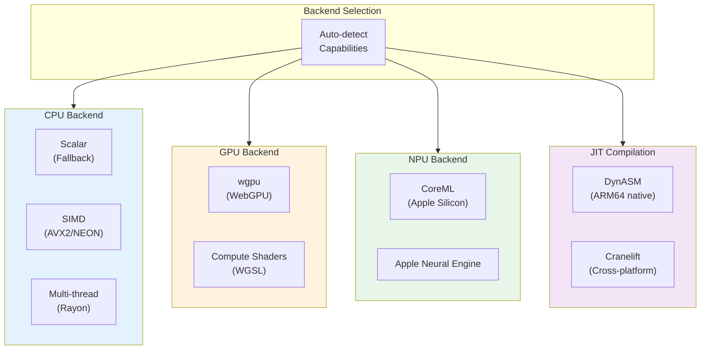

---

## 12. Roteamento Edge (ρ_sil)

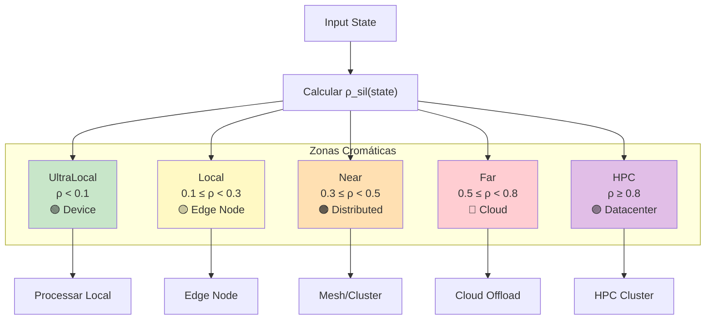

---

## 13. Aprendizado Federado

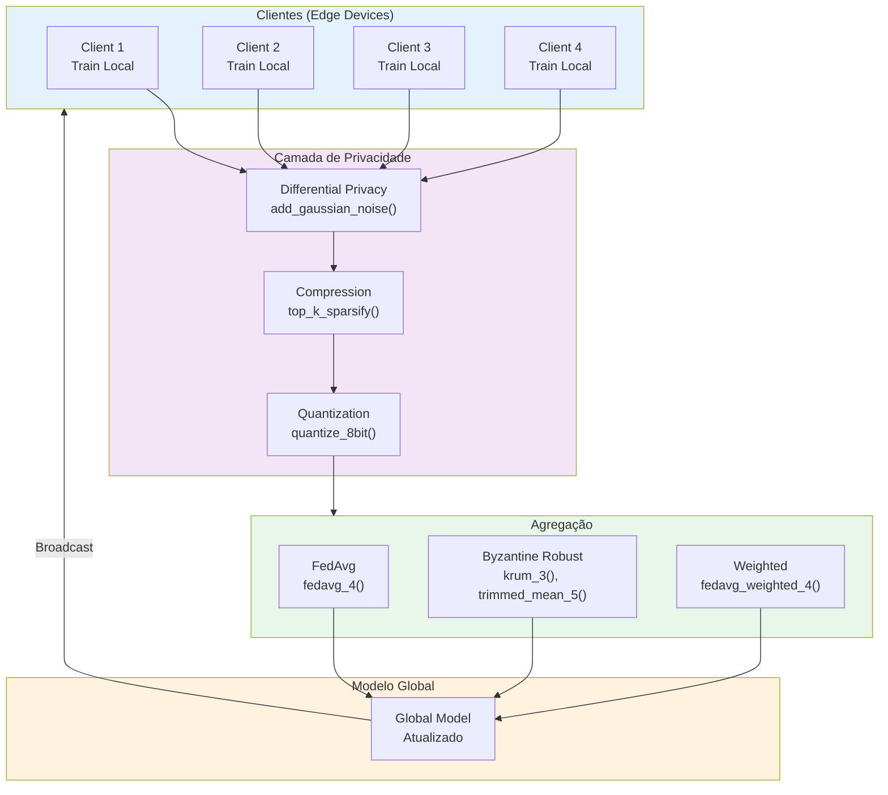

---

## 14. API REST (lis-api)

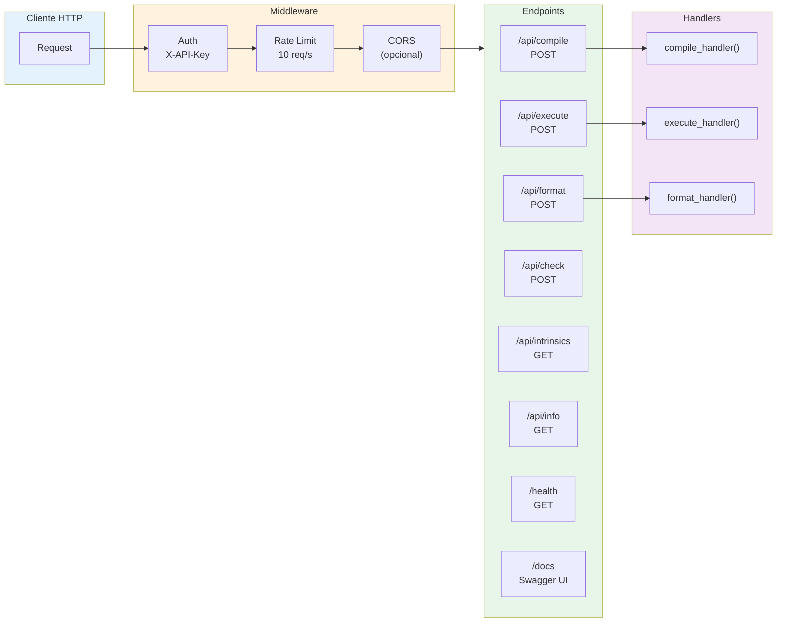

---

## 15. Orchestrator

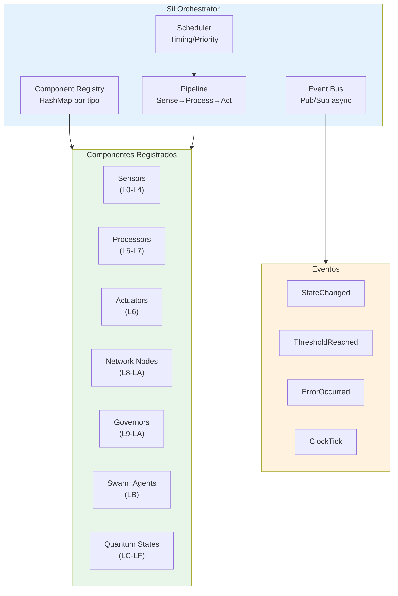

---

## 16. Fluxo de Compilação CLI

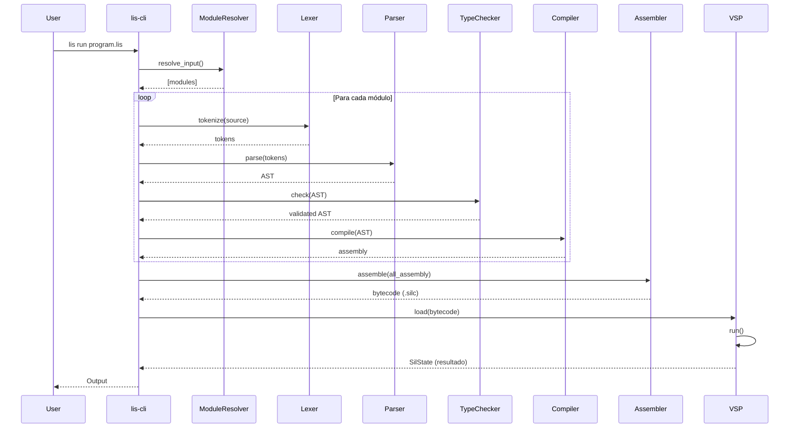

---

## 17. Arquitetura de Rede Neural (Forward Pass)

```mermaid
flowchart LR
    INPUT["Input<br/>State"]

    subgraph LAYER1["Layer 1"]
        D1["dense_forward()"]
        N1["layer_norm()"]
        A1["relu()"]
    end

    subgraph LAYER2["Layer 2"]
        D2["dense_forward()"]
        N2["layer_norm()"]
        A2["relu()"]
        DROP["dropout()"]
    end

    subgraph OUTPUT_LAYER["Output Layer"]
        D3["dense_forward()"]
        SOFT["softmax()"]
    end

    OUTPUT["Output<br/>State"]

    INPUT --> D1
    D1 --> N1
    N1 --> A1
    A1 --> D2
    D2 --> N2
    N2 --> A2
    A2 --> DROP
    DROP --> D3
    D3 --> SOFT
    SOFT --> OUTPUT

    style INPUT fill:#e3f2fd
    style OUTPUT fill:#e8f5e9
    style LAYER1 fill:#fff3e0
    style LAYER2 fill:#f3e5f5
    style OUTPUT_LAYER fill:#fce4ec
```

---

## 18. Transformer Block

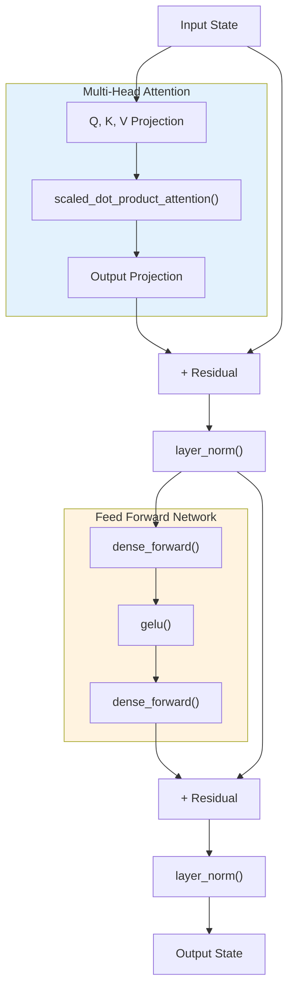

---

## 19. Extensão VSCode

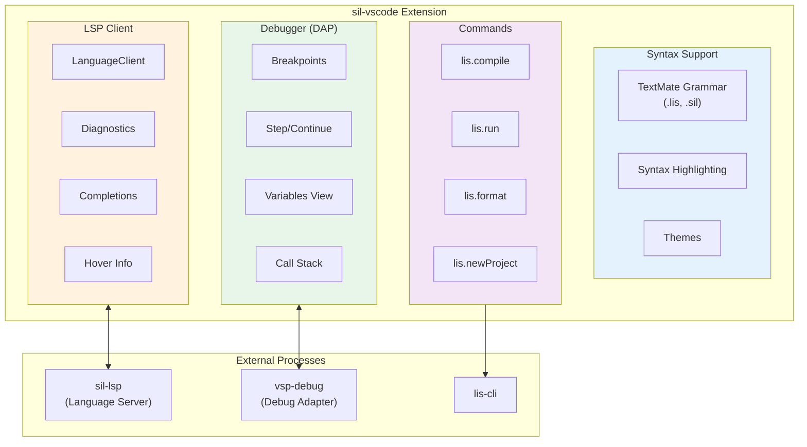

---

## 20. Visão Geral Completa

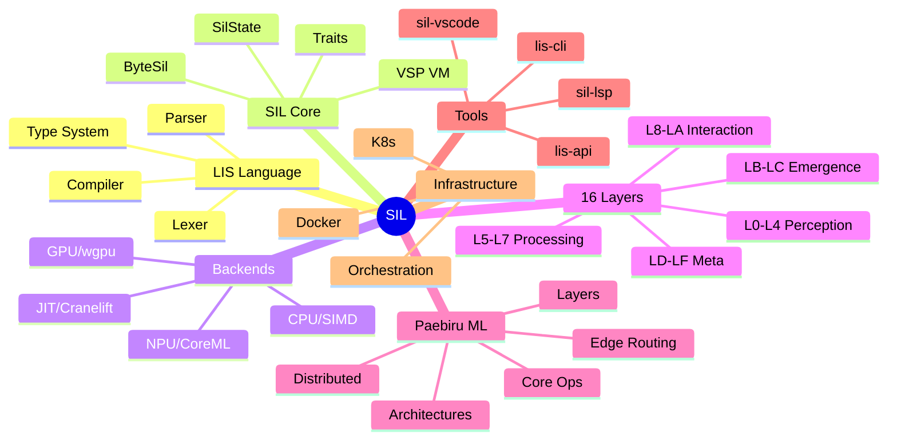

---

## Referências

- [README.md](../README.md) - Visão geral do projeto
- [ARCHITECTURE.md](ARCHITECTURE.md) - Fundamentos filosóficos
- [LIS_SIL_DOCUMENTATION.md](LIS_SIL_DOCUMENTATION.md) - Documentação completa da linguagem
- [PERFORMANCE.md](PERFORMANCE.md) - Benchmarks e otimizações
- [PAEBIRU.md](PAEBIRU.md) - Documentação da biblioteca ML

---

*Diagramas gerados com Mermaid - SIL/LIS 2026*
